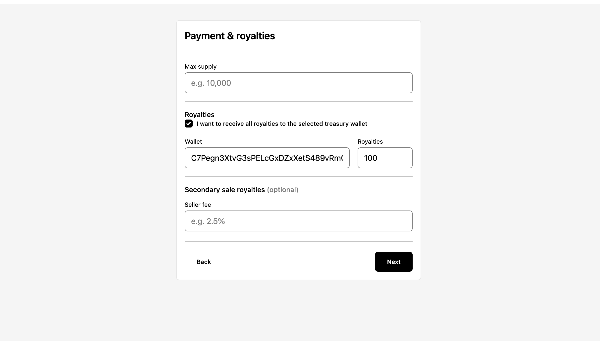
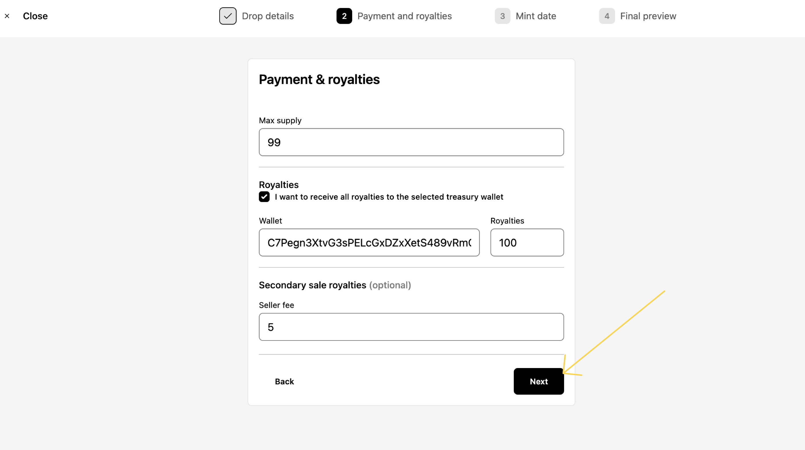
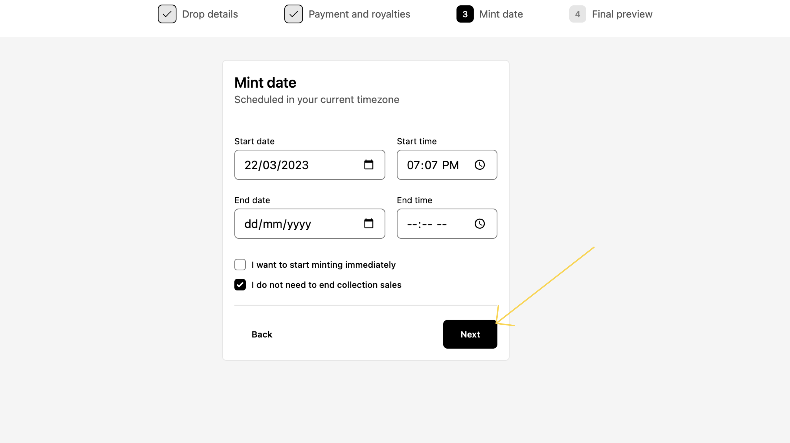
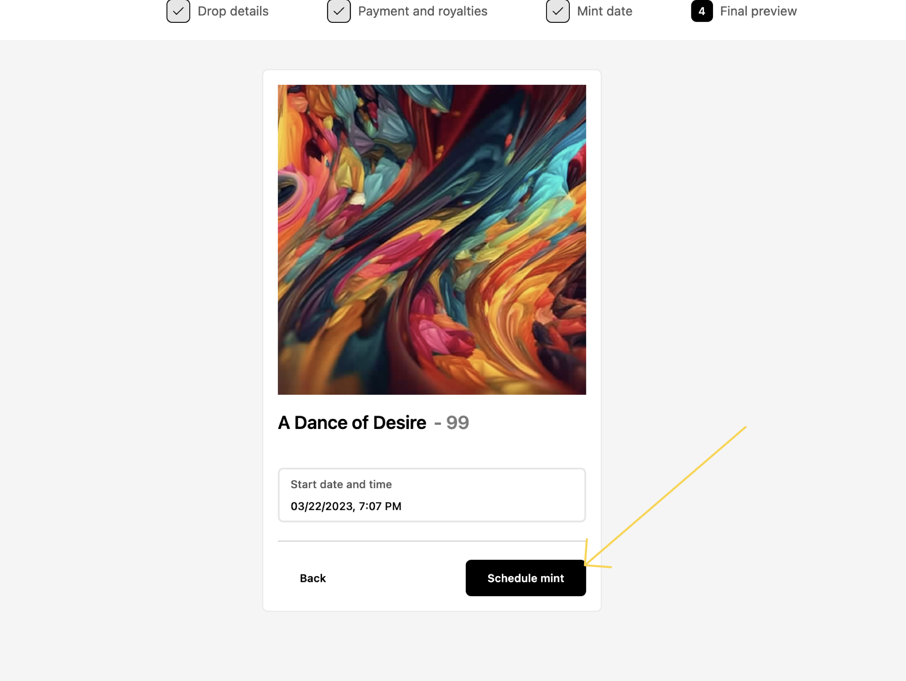

Creating Drops
==============

Introduction
------------

Drops are where the magic happens. Each "drop" is a collection of limited edition NFTs numbered from 1 to N, where N is the maximum supply for the drop you've chosen. So, if you set up a drop of 1000 NFTs, each individual NFTs will get a number from #1, #2, #3 and so on, to #1000.

Drops can be used for all kinds of campaigns, whether that's pairing your drop with a physical item, or offering a token-gating experience for your buyers on discord or spotify, NFT drop campaigns are known to drive engagement & revenue when they are done right.

Follow the steps below to set up a drop →

How to Create a Drop
------------

**Step 1**

Click on a project from the list of the projects you've created. 

If your projects page is empty, you should create a project. There's a guide for how to do it [here](./creating-a-project)!

**Step 2**

From here, if you've never created a drop for your project before, you'll see an empty screen that asks you to create your first drop. Click on the "Create Drop" button as shown below -

If you have created a Drop, the "Create Drop" button will be located on the top-right side of the screen.

**Step 3**

Enter your drop details. Be extra careful here, as these will be the details that your customers see. Once you've entered your details, it should look like this -

Click on Next.

**Step 4**

Now, you'll have to enter details about your payment & royalties.

-   Maximum Supply indicates the total supply of the NFTs you wish to sell. It can be as low as 1, or 10,000.
-   Price in Sol indicates the price that the NFTs will each be sold for.
-   Every NFT sold is charged a small fee. [NEED CLARIFICATION]
-   If you select the option "I want to receive all royalties to the selected treasury wallet", all royalties will be sent to your treasury wallet. Not selecting this allows you to enter an address that will be used to send the funds to.
-   Secondary Sales royalties refers to the royalties you'd get if the NFTs are resold by the buyer on a secondary marketplace. Putting this at 0 would mean there are no secondary royalties, but anything else would signify that you'd earn royalties whenever that NFT is sold again on a secondary marketplace, forever.

Once you've entered the details, it should look like this -

Click on Next.

**Step 5**

Select the date & time from when you want minting to begin, and when you want minting to end. Once you're done, click on Next.

-   If you choose to start minting immediately, your collection will be immediately up for sale.
-   If you choose not to set an end-date and want your collection sales to continue forever, you can choose the option "I don't need to end collection sales".

**Step 6**

Verify in the preview screen that everything looks good.

If something doesn't or if you feel there's been some mistake, you can click on the back button to fix that.

If everything looks good, click on the Schedule Mint or Mint button.

**Step 7**

And you're done! You've just set up a drop! 

You should be able to see your drop on the Manage Drops screen now -

Awesome job! Now, we must learn how to mint a drop. 